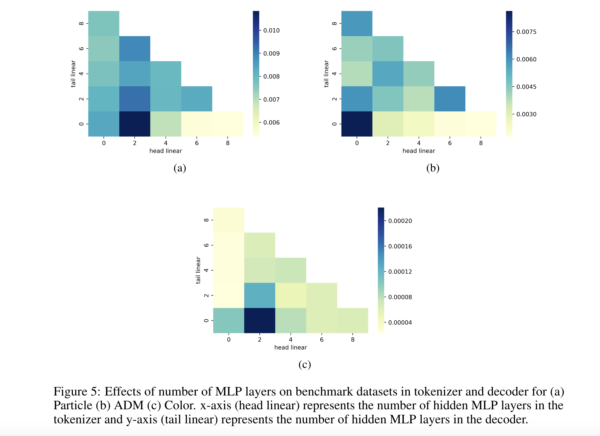
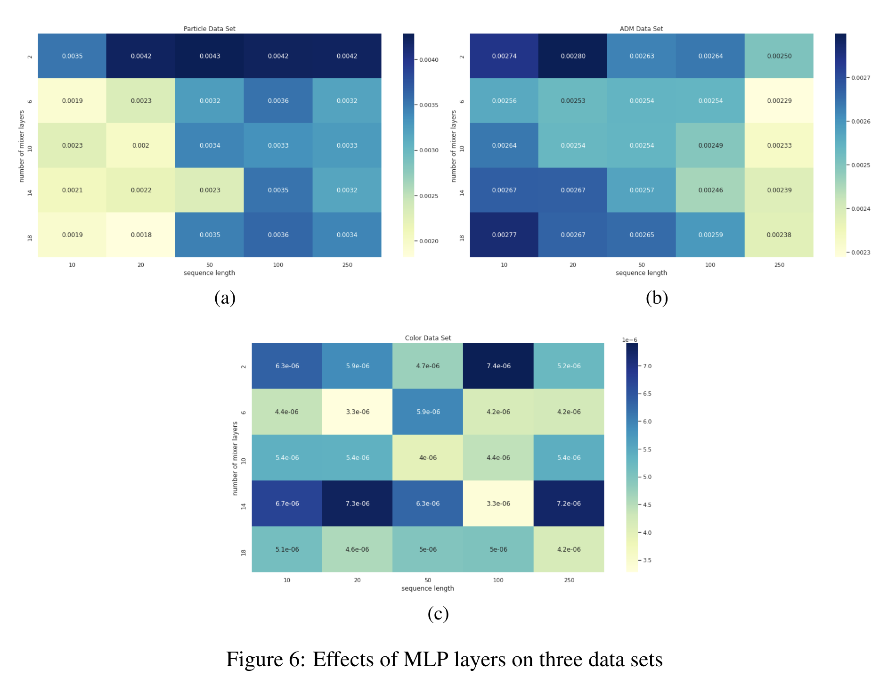

# Benchmarking ADM problems with various DL structures
This repository stores implemention of paper [Benchmarking Data-driven Surrogate Simulators for Artificial Electromagnetic Materials]() 

It includes a suit of ADM data set benchmarks along with implementation of various ready-to-use deep learning architectures (MLP, Transformer, MLP-Mixer) for scientific computation problem and a handful of utility functions.

## Data Sets

[TO ADD DESCRIPTION]

## Requirements
| Package | Version |
|:---------------------------------------------:|:------------------------------------------------------------------:|
| Python | \>=3.7 |
| Pytorch | \>= 1.3.1 |
| Numpy  | \>=1.17.4 |
| Pandas | \>=0.25.3 |
| Tensorboard | \>=2.0.0 |
| Tqdm| \>=4.42.0 |
| Sklearn | \>=0.22.1|
| Matplotlib | \>= 3.1.3|
| einops | \>= 0.3.0|
| seaborn | \>= 0.11.2|
### Environment
1. The detailed conda environment is packaged in [.yml file](./demo/environment_droplet.yml).
2. Add the [Benchmarking folder](./Benchmarking%20Algorithms) as one of the source directory to make utils and Simulated_Dataset folders 
visible runtime

## Features 
* Access to various ADM data sets 
* **Off-the-shelf implementation** of MLP, Transformer and MLP-Mixer with high individuality
* Utilities for **data preprocessing and preparation** for downstream deep learning tasks
* Utilities for **plotting** and easy analysis of results

## Results

### Performance of various DL structures on benchmark ADM data sets


<!--  -->
### Effect of Hyper-parameters on Transformer's performance

<!--  -->

### Effect of Hyper-parameters on MLP-Mixer's performance

<!--  -->


## Usage

### Access to Data Sets
1. ADM Data Set. Please download and unzip from the [Repository](https://doi.org/10.7924/r4jm2bv29).
2. Particle Data Set. Please download and unzip from the [Repository](https://doi.org/10.7924/r4jm2bv29).
3. Color Data Set. Please download and unzip from the [Repository](http://dx.doi.org/10.5258/SOTON/D1686).

### Download Pre-trained Models 
1. MLP: Please download and unzip from the [folder]().
2. Transformer: Please download and unzip from the [folder]().
3. MLP-Mixer: Please download and unzip from the [folder]().

### Loading and Spliting the Data Sets
```
from util import *

dataset = Load_ADM()
train_X, train_Y, val_X, val_Y, test_X, test_Y = train_val_test_split(data_set)
```

### Loading Models with configurable hyper-paramters and making prediction
```
from models import DukeTransformer, DukeMIXER
model_transformer = DukeTransformer(...)
model_mixer = DukeMIXER(...)

model_transformer.train(train_X, train_Y, epochs = .., lr = ..)
model_transformer(test_X)
model_mixer(test_X)
```
### Building heatmap and Plotting
```
import seaborn as sns
from models import DukeTransformer
from sweep import sweep
result = sweep(DukeTransformer, sweep_dict)
heatmap = build_heatmap(result)
sns.heatmap(heatmap)
```

## Support

Please file an issue [here](https://github.com/ydeng-MLM/ML_MM_Benchmark/issues).

## License

The project is licensed under the [MIT license](https://github.com/ydeng-MLM/ML_MM_Benchmark/blob/main/LICENSE).

Please cite this work if some of the code or datasets are helpful in your scientific endeavours. For specific datasets, please also cite the respective original source(s), given in the preprint.
